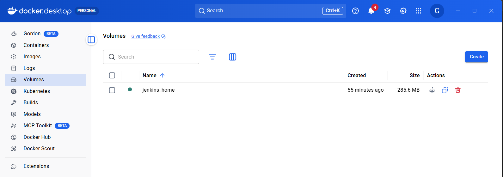
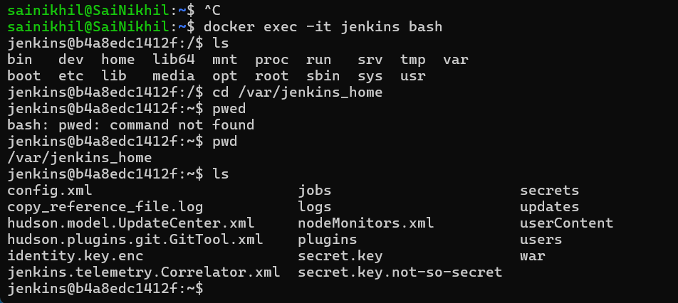

# Jenkins Setup Using Docker - Learning Notes

## Objective

Install Jenkins using Docker, understand each Docker command, and log in to Jenkins for the first time.

---

# Prerequisites

## Verify Docker Installation

### PowerShell

```bash
docker --version
```

Expected Output:

```text
Docker version 29.x.x
```

### Verify Docker Engine

```bash
docker ps
```

Expected Output:

```text
CONTAINER ID   IMAGE   COMMAND
```

If no containers are running, that's fine.

---

# WSL Integration (Windows Users)

If Docker works in PowerShell but not in Ubuntu WSL:

```text
command 'docker' could not be found in this WSL 2 distro
```

Enable WSL Integration:

```text
Docker Desktop
    ↓
Settings
    ↓
Resources
    ↓
WSL Integration
    ↓
Enable Ubuntu
    ↓
Apply & Restart
```

Verify:

```bash
docker --version
docker ps
```

---

# Jenkins Docker Image

Docker images are templates used to create containers.

Example:

```text
Image
  ↓
Container
```

Jenkins Image:

```text
jenkins/jenkins:lts
```

Where:

```text
Repository : jenkins/jenkins
Tag        : lts
```

LTS = Long Term Support version.

---

# Pulling Jenkins Image

```bash
docker pull jenkins/jenkins:lts
```

Purpose:

* Downloads Jenkins image from Docker Hub.
* Stores image locally.

Verify:

```bash
docker images
```

Expected:

```text
REPOSITORY         TAG
jenkins/jenkins    lts
```

Note:

`docker pull` is optional because `docker run` automatically pulls the image if it is not available locally.

---

# Running Jenkins Container

```bash
docker run -d \
--name jenkins \
-p 8080:8080 \
-p 50000:50000 \
-v jenkins_home:/var/jenkins_home \
jenkins/jenkins:lts
```

---

# Understanding Each Option

## docker run

Creates and starts a container from an image.

```text
Image
   ↓
Container
```

---

## -d

Detached Mode.

Runs container in the background.

Without:

```bash
docker run nginx
```

Terminal remains occupied.

With:

```bash
docker run -d nginx
```

Container runs in background.

---

## --name jenkins

Assigns a friendly name.

Instead of:

```text
7f8e9d6a5b4c
```

You can use:

```text
jenkins
```

Example:

```bash
docker logs jenkins
docker stop jenkins
```

---

## -p 8080:8080

Port Mapping.

Format:

```text
host_port:container_port
```

Meaning:

```text
Laptop Port 8080
        ↓
Container Port 8080
```

Used for Jenkins Web UI.

Access:

```text
http://localhost:8080
```

---

## -p 50000:50000

Port used for Jenkins agents.

Used when Jenkins communicates with build nodes.

---

## -v jenkins_home:/var/jenkins_home

Volume Mapping.

Format:

```text
-v host_volume:container_path
```

Meaning:

```text
Host Volume
jenkins_home

Container Path
/var/jenkins_home
```

Purpose:

Persist Jenkins data.

Stores:

* Jobs
* Plugins
* Users
* Credentials
* Build History

Without volume:

```text
Delete Container
       ↓
All Jenkins Data Lost
```

With volume:

```text
Delete Container
       ↓
Volume Remains
       ↓
Data Preserved
```

---

# Understanding Volumes

Docker automatically creates:

```text
jenkins_home
```

Actual Linux location:

```text
/var/lib/docker/volumes/jenkins_home/_data
```

Container Path:

```text
/var/jenkins_home
```

Mapping:

```text
Host
/var/lib/docker/volumes/jenkins_home/_data
                    │
                    ▼
Container
/var/jenkins_home
```

---

# Verify Jenkins Container

List running containers:

```bash
docker ps
```

Example:

```text
CONTAINER ID   IMAGE                 NAMES
abc123         jenkins/jenkins:lts   jenkins
```

---

# Container ID vs Container Name

Container ID:

```text
abc123456789
```

Container Name:

```text
jenkins
```

Most commands use the name because it is easier.

Examples:

```bash
docker logs jenkins
docker stop jenkins
docker start jenkins
```

---

# Retrieve Jenkins Initial Password

Method 1:

```bash
docker exec jenkins cat /var/jenkins_home/secrets/initialAdminPassword
```

Method 2:

```bash
docker exec -it jenkins bash
```

Then:

```bash
cat /var/jenkins_home/secrets/initialAdminPassword
```

Copy the password.

---
 ## Method 1: Understanding docker exec

Used to execute commands inside a running container.

### Single Command

```bash
docker exec jenkins cat /var/jenkins_home/secrets/initialAdminPassword
```

Meaning:

```text
Go inside Jenkins container
        ↓
Run cat command
        ↓
Return output
```

Useful for one-time commands.

---

## Method 2: Interactive Shell

```bash
docker exec -it jenkins bash
```

Meaning:

```text
Go inside Jenkins container
        ↓
Open Bash Shell
        ↓
Allow user interaction
```

Now you are inside the container.

Example:

```bash
pwd
ls
whoami
```

Exit:

```bash
exit
```

---
## Method 3: Using docker logs
 Running:
 ```bash
 docker logs container_id
 ```
 search for `Please use the following password to proceed to installation:`

## Common Mistake

Running:

```bash
cat /var/jenkins_home/secrets/initialAdminPassword
```

on Ubuntu host.

This fails because:

```text
Ubuntu Host
        ≠
Jenkins Container
```

The file exists inside the container, not on the host.

Correct command:

```bash
docker exec jenkins cat /var/jenkins_home/secrets/initialAdminPassword
```


# Login to Jenkins

Open browser:

```text
http://localhost:8080
```

You will see:

```text
Unlock Jenkins
```

Paste the password obtained from:

```bash
docker exec jenkins cat /var/jenkins_home/secrets/initialAdminPassword
```

Click:

```text
Continue
```

Jenkins setup wizard starts.

---

# Viewing the Jenkins Volume Location

## Check Existing Docker Volumes

List all Docker volumes:

```bash
docker volume ls
```

Example:

```text
DRIVER    VOLUME NAME
local     jenkins_home
```

This confirms that Docker created a volume named:

```text
jenkins_home
```

---

# Inspect the Volume

To see where Docker stores the volume data:

```bash
docker volume inspect jenkins_home
```

Example Output:

```json
[
  {
    "CreatedAt": "2025-01-01T10:00:00Z",
    "Driver": "local",
    "Mountpoint": "/var/lib/docker/volumes/jenkins_home/_data",
    "Name": "jenkins_home"
  }
]
```

Important field:

```text
Mountpoint
```

Example:

```text
/var/lib/docker/volumes/jenkins_home/_data
```

This is the physical storage location used by Docker.

---

# Understanding the Mapping

When Jenkins was started:

```bash
docker run -d \
--name jenkins \
-p 8080:8080 \
-p 50000:50000 \
-v jenkins_home:/var/jenkins_home \
jenkins/jenkins:lts
```

Docker created the following mapping:

```text
Host Side (Docker Volume)
jenkins_home
        │
        ▼
Container Side
/var/jenkins_home
```

Internally:

```text
Host
/var/lib/docker/volumes/jenkins_home/_data
                    │
                    ▼
Container
/var/jenkins_home
```

---

# Can I directly browse to that path?

If you're running Docker Desktop on Windows, it gets interesting.

Your architecture is roughly:
```text
Windows
   │
   ▼
Docker Desktop VM
   │
   ▼
Docker Volumes
```

So the path:

```/var/lib/docker/volumes/jenkins_home/_data```

exists inside Docker's Linux environment, not directly as a normal Windows folder.



# View Jenkins Files Inside the Container

Connect to the Jenkins container:

```bash
docker exec -it jenkins bash
```

Navigate to Jenkins home:

```bash
cd /var/jenkins_home
ls
```

Example:

```text
jobs
plugins
secrets
users
workspace
config.xml
```

These files are actually stored inside the Docker volume.



---

# View Volume Contents Without Entering Jenkins

Mount the volume into a temporary Ubuntu container:

```bash
docker run --rm -it \
-v jenkins_home:/data \
ubuntu bash
```

Inside the container:

```bash
cd /data
ls
```

Output:

```text
jobs
plugins
secrets
users
workspace
config.xml
```

This is useful for troubleshooting or backing up Jenkins data.

---

# Important Jenkins Directories

## jobs

Contains Jenkins jobs and pipeline configurations.

```text
jobs/
└── MyPipeline/
```

---

## plugins

Installed Jenkins plugins.

```text
plugins/
```

---

## users

Jenkins user accounts.

```text
users/
```

---

## secrets

Stores Jenkins secrets.

Contains:

```text
initialAdminPassword
```

Used during first-time setup.

---

## workspace

Stores source code checked out during builds.

Example:

```text
workspace/
└── my-python-app/
```

---

# Why Volumes Matter

Without a volume:

```text
Delete Container
        ↓
Lose Jobs
Lose Plugins
Lose Users
Lose Credentials
```

With a volume:

```text
Delete Container
        ↓
Volume Remains
        ↓
All Jenkins Data Preserved
```

This is why Jenkins containers should almost always use:

```bash
-v jenkins_home:/var/jenkins_home
```

for persistent storage.


# Key Concepts Learned

* Docker Image
* Docker Container
* Docker Volume
* Port Mapping
* Detached Mode
* Container Name
* Container ID
* docker run
* docker exec
* docker exec -it
* Jenkins Initial Password
* Jenkins Login Process

---

# Architecture Diagram

```text
Browser
   │
   ▼
localhost:8080
   │
   ▼
Docker Container (jenkins)
   │
   ▼
/var/jenkins_home
   │
   ▼
Docker Volume (jenkins_home)
```
