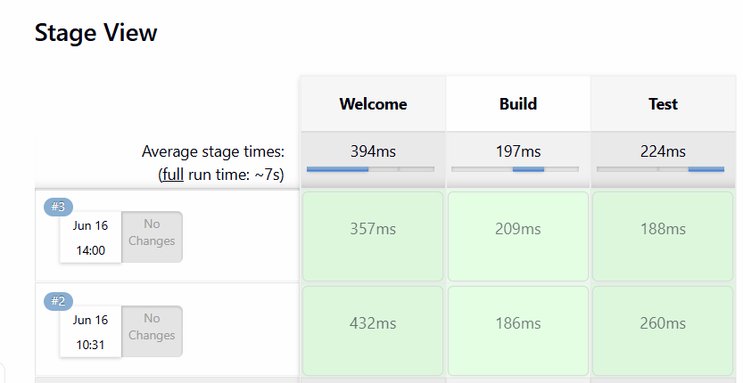
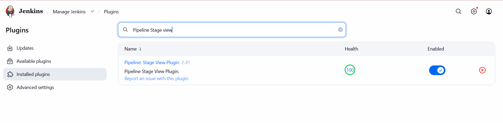

Jenkins Pipeline Creation Types

1. Pipeline Script (Inline Pipeline) 
   ```New Item → Pipeline → Definition: Pipeline Script```

2. Pipeline Script from SCM 
   ```text
   New Item → Pipeline → Definition: Pipeline Script from SCM
   Source: GitHub / Bitbucket
   File: Jenkinsfile
   ```

3. Multibranch Pipeline
   ```
   New Item → Multibranch Pipeline
   Auto-discovers branches and Jenkinsfiles
   ```

4. Shared Library Based Pipeline
   ```
   Uses reusable pipeline code
   @Library('shared-lib') _
   ```

5. Enterprise Centralized Pipeline
   ```Pipeline code maintained in a central repo```
   
   (Similar to your company's handbook repo)

------------------------------------------------

Legacy Job Types

6. Freestyle Project
   UI-based configuration
   No Jenkinsfile

7. Multi-Configuration Project
   Matrix builds (Java 8, 11, 17 etc.)

------------------------------------------------

Recommended Learning Path

1. Pipeline Script (Inline Pipeline)                   
2. Pipeline Script from SCM   
3. Jenkinsfile
4. GitHub Integration
5. Webhooks
6. Multibranch Pipeline
7. Shared Libraries
8. Enterprise Handbook/Centralized Pipelines

------------------------------------------------

# Pipeline Script in Jenkins vs Pipeline as Code
Difference from Jenkinsfile

when you're creating JenkinsFile in UI:
```text
Jenkins UI
      │
      ▼
Pipeline Script (Inline Pipeline) 
```

is called: ``Pipeline Script in Jenkins``

When JenkinsFile is in Repo.
```text
GitHub Repo
├── app.py
└── Jenkinsfile
```

and Jenkins will read the pipeline from GitHub.

That is called: ``Pipeline as Code``

# Stage View / Pipeline Visualization 
 
 TO view the Pipeline visualization as below, install the plugin:

 ```Manage Jenkins -> plugins -> Installed Plugins```

 ```text
    Pipeline: Stage View Plugin
 ```



